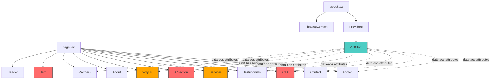
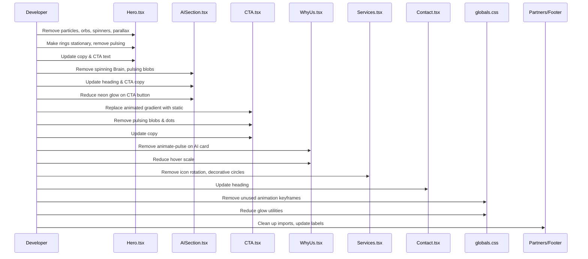
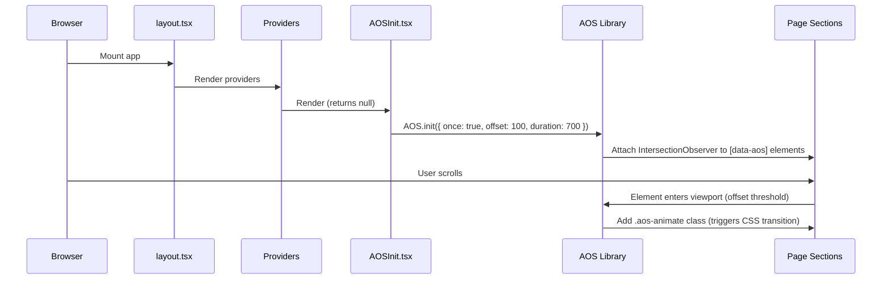

# Design Document: Landing Page Polish

## Overview

This feature removes AI-generated aesthetic patterns from the CosmoBits Technologies landing page to make it feel more professional and hand-crafted. The work is subtle — no radical redesigns — focusing on taming excessive animations, replacing gimmicky effects with restrained alternatives, and softening overly generic "AI template" copy. The spinning Brain icon becomes stationary, floating/pulsing elements are reduced or removed, and neon glow effects are dialed back.

The goal is to preserve the existing brand identity (purple palette, dark sections, modern feel) while removing the telltale signs of AI-generated design: infinite spinners, particle fields, pulsing orbs, and buzzword-heavy headings.

## Architecture

The landing page is a single Next.js page (`src/app/page.tsx`) composed of discrete React components rendered sequentially. All animations use `framer-motion`. Styling uses Tailwind CSS v4 with custom CSS variables defined in `globals.css`.



Legend: Red = high number of issues, Orange = moderate issues, Default = minor/no issues, Teal = AOS initialization.

**Note:** AOSInit is a client component rendered inside Providers. It calls `AOS.init()` on mount and applies scroll-triggered animations to all sections below the fold via `data-aos` attributes. The Hero section is excluded — it uses its existing framer-motion entrance animation.

## Components and Interfaces

No new components are introduced. This is a refactor-in-place across existing components. Each component file is modified independently.

## Audit Findings & Proposed Fixes

### Component 1: Hero (`src/components/Hero.tsx`)

**Severity: HIGH — This is the worst offender.**

| # | Issue | Category | Proposed Fix |
|---|-------|----------|--------------|
| 1 | Spinning Brain icon (`animate: rotate: 360`, infinite) in AI badge | Gimmicky animation | Make stationary — remove the `motion.div` wrapper around `<Brain>` |
| 2 | 15 FloatingParticle elements with perpetual y/x oscillation | Excessive particles | Remove entirely. They add visual noise on every viewport. |
| 3 | AIOrb component (pulsing scale/opacity, infinite) | Gimmicky animation | Remove the AIOrb component (unused in render but declared) |
| 4 | SVG "Neural Network Lines" — 8 animated diagonal lines | AI-template decoration | Remove the SVG block entirely |
| 5 | Mouse-tracking parallax on gradient orbs + center logo | Distracting interaction | Remove `mousePosition` state and the `mousemove` listener. Make orbs static with fixed subtle opacity. |
| 6 | Outer ring rotating 360° (20s infinite) with 8 dots | Spinning sci-fi element | Stop rotation — make ring stationary |
| 7 | Middle ring counter-rotating 360° (15s infinite) with 6 dots | Spinning sci-fi element | Stop rotation — make ring stationary |
| 8 | Inner glow circle pulsing boxShadow (3s infinite) | Pulsing glow | Remove pulsing — set a single static subtle shadow |
| 9 | Center logo box pulsing boxShadow (2s infinite) | Pulsing glow | Remove pulsing — use a static shadow |
| 10 | Floating orbs around center logo (bouncing y, infinite) | Floating elements | Remove the Zap/Sparkles floating orbs |
| 11 | Scroll indicator bouncing (y: [0,8,0], infinite) | Minor annoyance | Keep the element but remove the bounce animation |
| 12 | Heading "The Future of Business is AI" | Generic AI buzzword headline | Rewrite to something more specific, e.g. "Technology that works for your business" or keep "AI" but remove the glowing blur behind "is AI" |
| 13 | Pulsing blur behind "is AI" text (opacity cycling, infinite) | Glow effect | Remove the `motion.div` blur element |
| 14 | CTA button text "Unlock AI Potential" | Buzzword CTA | Change to "Get in Touch" or "Talk to Us" |
| 15 | Stats "10x Efficiency Gains", "98% Client Satisfaction", "24/7 AI Support" | Generic/unsubstantiated claims | Consider more honest stats or remove "AI" from "AI Support" → "Technical Support" |

---

### Component 2: AISection (`src/components/AISection.tsx`)

**Severity: HIGH**

| # | Issue | Category | Proposed Fix |
|---|-------|----------|--------------|
| 1 | Spinning Brain icon (identical to Hero — `rotate: 360`, 4s infinite) | Gimmicky animation | Make stationary |
| 2 | Two background blobs pulsing scale/opacity (5s + 6s, infinite) | Pulsing decorations | Make static blurred blobs with fixed opacity |
| 3 | Pulsing blur behind "AI" text in heading (opacity cycling) | Glow effect | Remove the blur `motion.div` |
| 4 | Heading "Supercharge Your Business with AI" | AI buzzword heading | Soften to "AI Solutions for Your Business" or "How AI Fits Your Workflow" |
| 5 | Copy: "Don't get left behind in the AI revolution" | Fear-mongering AI cliché | Rewrite to factual value prop, e.g. "Our team helps you implement intelligent solutions that automate processes and unlock insights." |
| 6 | Stats: "300% Average ROI", "99.9% Accuracy Rate" | Unsubstantiated/generic claims | Tone down or add asterisk context. Keep the visual layout but use more credible figures or label as "up to" |
| 7 | Service cards hover: `whileHover={{ y: -8 }}` + icon `whileHover={{ rotate: 5, scale: 1.1 }}` | Excessive micro-interactions | Keep the y-lift on cards (subtle), remove icon rotation |
| 8 | CTA button with `boxShadow: '0 0 40px ...'` static neon glow | Neon glow | Reduce to `0 0 20px` or remove entirely — use brand shadow instead |
| 9 | CTA text "Start Your AI Journey" | Buzzword CTA | Change to "Get a Free Consultation" |
| 10 | Sparkles icon in badge + throughout | Emoji-like decorative icons | Remove Sparkles from the badge — keep the Brain icon alone |

---

### Component 3: CTA (`src/components/CTA.tsx`)

**Severity: HIGH**

| # | Issue | Category | Proposed Fix |
|---|-------|----------|--------------|
| 1 | `animate-gradient-x` on entire background (animated gradient) | Distracting background animation | Use a static gradient instead |
| 2 | Two pulsing blobs (scale + opacity cycling, 4s infinite) | Pulsing decoration | Remove or make static |
| 3 | Three trust indicator dots with `animate-pulse` | Pulsing dots | Replace with static filled circles (remove `animate-pulse`) |
| 4 | Badge text "Ready to Transform Your Business?" | Generic AI template copy | Remove the badge entirely or simplify to section context |
| 5 | CTA button "Start Your AI Journey" with Rocket icon | Buzzword + emoji-like icon | Change to "Get Started" or "Schedule a Call" with ArrowRight |
| 6 | Heading uses "Let's Build the Future" | Cliché AI template heading | More direct: "Ready to get started?" or "Let's talk about your project" |

---

### Component 4: WhyUs (`src/components/WhyUs.tsx`)

**Severity: MODERATE**

| # | Issue | Category | Proposed Fix |
|---|-------|----------|--------------|
| 1 | First card ("AI-First Approach") has `animate-pulse` on overlay div | Pulsing glow on card | Remove the `animate-pulse` from the gradient overlay |
| 2 | Cards `whileHover={{ y: -8, scale: 1.02 }}` | Slightly over-animated hover | Keep `y: -5`, remove `scale` |
| 3 | Two decorative blurred gradient blobs in background | Gradient overuse | Acceptable — keep but consider reducing opacity further |
| 4 | Description copy is generic but acceptable | Minor | No change needed — copy is serviceable |

---

### Component 5: Services (`src/components/Services.tsx`)

**Severity: MODERATE**

| # | Issue | Category | Proposed Fix |
|---|-------|----------|--------------|
| 1 | Icon `whileHover={{ scale: 1.1, rotate: 5 }}` | Unnecessary rotation | Remove `rotate: 5`, keep subtle `scale: 1.05` |
| 2 | Decorative radial gradient circle (`absolute -bottom-20 -right-20`) per card | Gradient overuse | Remove these decorative circles — they add visual noise |
| 3 | Expanded card features animate in with stagger (`delay: i * 0.05`) | Minor | Acceptable — keep |
| 4 | Background grid pattern | Already subtle | No change |

---

### Component 6: Header (`src/components/Header.tsx`)

**Severity: LOW**

| # | Issue | Category | Proposed Fix |
|---|-------|----------|--------------|
| 1 | Logo `whileHover={{ scale: 1.05 }}` | Minor | Acceptable — no change |
| 2 | Overall structure is clean | — | No changes needed |

---

### Component 7: About (`src/components/About.tsx`)

**Severity: LOW**

| # | Issue | Category | Proposed Fix |
|---|-------|----------|--------------|
| 1 | Mission/Vision card blur that grows on hover (`blur-xl → blur-2xl`) | Subtle glow growth | Acceptable — keep |
| 2 | Value cards `whileHover={{ y: -5 }}` | Acceptable | No change |
| 3 | Stats use CounterAnimation | Clean implementation | No change |

---

### Component 8: Partners (`src/components/Partners.tsx`)

**Severity: LOW**

| # | Issue | Category | Proposed Fix |
|---|-------|----------|--------------|
| 1 | Unused imports: `Building2, Landmark, Factory, Store, Globe, Shield` | Dead code | Remove unused imports |
| 2 | Label "Trusted by Leading Organizations" | Slightly grandiose for 4 partners | Change to "Our Partners" or "We work with" |
| 3 | Marquee animation is clean | — | No change |

---

### Component 9: Testimonials (`src/components/Testimonials.tsx`)

**Severity: LOW**

| # | Issue | Category | Proposed Fix |
|---|-------|----------|--------------|
| 1 | All testimonials have 5-star ratings (feels fake) | Generic testimonial data | Not a code fix — content concern. Leave as-is for now. |
| 2 | Avatar shows first letter initial (no real photos) | Missing assets | Acceptable — no change needed in this pass |
| 3 | Structure is clean | — | No changes needed |

---

### Component 10: Contact (`src/components/Contact.tsx`)

**Severity: LOW**

| # | Issue | Category | Proposed Fix |
|---|-------|----------|--------------|
| 1 | Heading "Let's Build Something Amazing Together" | Generic template heading | Soften to "Get in Touch" (keep the gradient span on simpler text) |
| 2 | Two decorative blur blobs | Minor | Acceptable |

---

### Component 11: Footer (`src/components/Footer.tsx`)

**Severity: LOW**

| # | Issue | Category | Proposed Fix |
|---|-------|----------|--------------|
| 1 | Newsletter heading "Stay Updated with AI Trends" | Minor AI buzzword | Change to "Stay in the Loop" or "Get Updates" |
| 2 | "Crafted with ❤️ in Nairobi" uses Heart icon | Minor — acceptable | No change |
| 3 | Social links are placeholder URLs (`https://linkedin.com`) | Incomplete | Not in scope for this polish pass |

---

### Component 12: FloatingContact (`src/components/FloatingContact.tsx`)

**Severity: NONE**

Clean implementation. No issues found.

---

### Component 13: CounterAnimation (`src/components/CounterAnimation.tsx`)

**Severity: NONE**

Clean implementation. Tasteful scroll-triggered counter. No changes needed.

---

### Global CSS (`src/app/globals.css`)

| # | Issue | Category | Proposed Fix |
|---|-------|----------|--------------|
| 1 | `@keyframes ai-pulse` (2s pulsing glow, aggressive) | Gimmicky keyframe | Remove or rename — unused after component fixes |
| 2 | `@keyframes pulse-glow` (3s pulsing glow) | Gimmicky keyframe | Remove if unused after fixes |
| 3 | `.glow-ai` with 50px box-shadow | Excessive glow utility | Remove or reduce to 20px |
| 4 | `.animate-ai-pulse` utility class | Template utility | Remove after component cleanup |
| 5 | `@keyframes float` (20px vertical bounce) | Gimmicky animation | Can keep but reduce amplitude to 8px for any remaining use |

---

## Sequence Diagram: Fix Application Order



## Key Functions with Formal Specifications

### Function: removeSpinningBrain()

```typescript
// In Hero.tsx and AISection.tsx — replace the motion wrapper around Brain icon

// BEFORE:
<motion.div
  animate={{ rotate: 360 }}
  transition={{ duration: 4, repeat: Infinity, ease: 'linear' }}
>
  <Brain className="w-4 h-4 text-ai-glow" />
</motion.div>

// AFTER:
<Brain className="w-4 h-4 text-ai-glow" />
```

**Preconditions:**
- Brain icon currently wrapped in a `motion.div` with infinite rotation

**Postconditions:**
- Brain icon renders stationary
- No layout shift occurs
- Icon size and color remain unchanged

---

### Function: removeHeroParticlesAndOrbs()

```typescript
// In Hero.tsx — remove the FloatingParticle map and AIOrb component

// REMOVE these declarations entirely:
const FloatingParticle = ...
const AIOrb = ...
const particleConfigs = [...]

// REMOVE from render:
{particleConfigs.map((config, i) => (
  <FloatingParticle key={i} ... />
))}
```

**Preconditions:**
- 15 particle elements and AIOrb component exist in Hero

**Postconditions:**
- No floating particles render
- No orphaned component declarations remain
- Hero visual is cleaner with just the gradient background

---

### Function: makeRingsStationary()

```typescript
// In Hero.tsx — remove animate={{ rotate: 360 }} from ring divs

// BEFORE (Outer Ring):
<motion.div
  className="absolute inset-0 rounded-full border-2 border-ai-glow/30"
  animate={{ rotate: 360 }}
  transition={{ duration: 20, repeat: Infinity, ease: 'linear' }}
>

// AFTER:
<div className="absolute inset-0 rounded-full border-2 border-ai-glow/30">

// Same pattern for Middle Ring (remove animate={{ rotate: -360 }})
```

**Preconditions:**
- Two concentric rings have infinite rotation animations

**Postconditions:**
- Rings render as static decorative circles
- Dot elements on rings remain visible in fixed positions
- No performance cost from perpetual animation

---

### Function: removePulsingGlows()

```typescript
// Pattern appears in Hero, AISection, CTA — remove pulsing boxShadow/opacity

// BEFORE (example from Hero center logo):
<motion.div
  className="w-32 h-32 md:w-40 md:h-40 rounded-3xl ..."
  animate={{
    boxShadow: [
      '0 0 40px rgba(168,85,247,0.4)',
      '0 0 80px rgba(168,85,247,0.6)',
      '0 0 40px rgba(168,85,247,0.4)',
    ],
  }}
  transition={{ duration: 2, repeat: Infinity }}
>

// AFTER:
<div
  className="w-32 h-32 md:w-40 md:h-40 rounded-3xl ..."
  style={{ boxShadow: '0 0 30px rgba(168,85,247,0.2)' }}
>
```

**Preconditions:**
- Multiple elements have cycling boxShadow or opacity animations

**Postconditions:**
- Elements have a single, tasteful static shadow
- No infinite animation timers running
- Visual hierarchy is maintained through static contrast

---

### Function: updateCopyAndCTAs()

```typescript
// Mapping of old text → new text across components

const copyUpdates = {
  // Hero
  "The Future of Business is AI": "Intelligent Solutions for Growing Businesses",
  "Unlock AI Potential": "Get in Touch",
  "Explore AI Solutions": "See Our Work",
  "Discover AI Solutions": "Scroll to explore",
  "24/7 AI Support": "24/7 Technical Support",
  
  // AISection
  "Supercharge Your Business with AI": "AI Solutions Built for Your Workflow",
  "Don't get left behind in the AI revolution.": "Our team implements intelligent solutions that automate processes, unlock insights, and create competitive advantages.",
  "Start Your AI Journey": "Book a Free Consultation",
  
  // CTA
  "Ready to Transform Your Business?": (remove badge entirely),
  "Let's Build the Future of Your Business Together": "Let's Talk About Your Next Project",
  "Start Your AI Journey": "Schedule a Call",
  
  // Contact
  "Let's Build Something Amazing Together": "Get in Touch",
  
  // Footer
  "Stay Updated with AI Trends": "Stay in the Loop",
  
  // Partners
  "Trusted by Leading Organizations": "Our Partners",
};
```

**Preconditions:**
- Copy exists as string literals in respective component files

**Postconditions:**
- No heading contains more than one AI buzzword
- CTAs use actionable, direct language
- No fear-mongering or hyperbolic claims in body copy

---

## Example Usage

```typescript
// Example: Hero.tsx after all fixes applied (simplified structure)

export default function Hero() {
  const scrollToContact = () => {
    document.getElementById('contact')?.scrollIntoView({ behavior: 'smooth' });
  };

  return (
    <section id="home" className="relative min-h-screen flex items-center justify-center overflow-hidden bg-linear-to-b from-primary-dark via-primary-medium to-primary-light">
      {/* Static grid background — no particles */}
      <div className="absolute inset-0 bg-grid-pattern opacity-50" />
      
      {/* Static gradient orbs — no mouse tracking */}
      <div
        className="absolute w-150 h-150 rounded-full"
        style={{
          background: 'radial-gradient(circle, rgba(196,150,196,0.1) 0%, transparent 70%)',
          top: '10%',
          right: '-10%',
        }}
      />

      <div className="container-custom relative z-10">
        <div className="grid lg:grid-cols-2 gap-12 items-center min-h-screen py-32">
          <motion.div
            initial={{ opacity: 0, x: -50 }}
            animate={{ opacity: 1, x: 0 }}
            transition={{ duration: 0.8, ease: 'easeOut' }}
            className="text-center lg:text-left"
          >
            {/* Badge — Brain is stationary */}
            <div className="inline-flex items-center gap-2 px-4 py-2 rounded-full bg-ai-glow/20 border border-ai-glow/40 mb-6">
              <Brain className="w-4 h-4 text-ai-glow" />
              <span className="text-accent-light text-sm font-medium">AI-Powered Solutions</span>
            </div>

            <h1 className="heading-xl text-white mb-6" style={{ fontFamily: 'var(--font-display)' }}>
              Intelligent Solutions for{' '}
              <span className="text-gradient-ai">Growing Businesses</span>
            </h1>

            <p className="body-lg text-white/70 mb-8 max-w-xl mx-auto lg:mx-0">
              We help African businesses harness the power of AI, delivering solutions
              in software development, cloud infrastructure, and IT equipment that
              drive sustainable growth.
            </p>

            <div className="flex flex-col sm:flex-row gap-4 justify-center lg:justify-start">
              <button onClick={scrollToContact} className="btn-primary inline-flex items-center justify-center gap-2">
                Get in Touch
                <ArrowRight className="w-5 h-5" />
              </button>
            </div>
          </motion.div>

          {/* Visual — static rings, no spinning */}
          <div className="relative flex items-center justify-center">
            <div className="relative w-75 h-75 md:w-100 md:h-100 lg:w-125 lg:h-125">
              <div className="absolute inset-0 rounded-full border-2 border-ai-glow/30">
                {/* Static dots on ring */}
              </div>
              <div className="absolute inset-12 rounded-full border border-accent/40">
                {/* Static dots on ring */}
              </div>
              <div className="absolute inset-0 flex items-center justify-center">
                <div className="w-32 h-32 md:w-40 md:h-40 rounded-3xl bg-linear-to-br from-accent to-ai-glow flex items-center justify-center shadow-xl">
                  <Bot className="w-16 h-16 md:w-20 md:h-20 text-primary-dark" />
                </div>
              </div>
            </div>
          </div>
        </div>
      </div>
    </section>
  );
}
```

## Data Models

No new data models introduced. This feature modifies only presentational JSX, Tailwind classes, and string literals across existing components.

## Correctness Properties

*A property is a characteristic or behavior that should hold true across all valid executions of a system — essentially, a formal statement about what the system should do. Properties serve as the bridge between human-readable specifications and machine-verifiable correctness guarantees.*

### Property 1: No infinite rotation animations remain

*For any* component in the landing page source, no element shall have `animate={{ rotate: 360 }}` (or -360) with `repeat: Infinity`. This verifies all spinning elements (Brain icon, orbital rings) are made stationary.

**Validates: Requirement 1.4**

### Property 2: No decorative pulse animations remain

*For any* component in the landing page source, no decorative element shall use the `animate-pulse` CSS class or a framer-motion `animate` prop that cycles `boxShadow` or `opacity` with `repeat: Infinity`. Loading spinners (Loader2) are excluded from this rule.

**Validates: Requirement 3.8**

### Property 3: Infinite animations are limited to entrance effects and marquee

*For any* `motion.div` element with `transition.repeat === Infinity`, the animated property must be limited to the marquee translateX — no perpetual rotation, scale, position (y/x oscillation), or boxShadow animations.

**Validates: Requirements 1.4, 3.8, 11.1**

### Property 4: Headings contain at most one AI buzzword

*For any* h1 or h2 element in the landing page, the combined count of buzzwords ("Future", "Journey", "Supercharge", "Revolution", "Transform") must be ≤ 1. The word "AI" itself is allowed once per heading.

**Validates: Requirements 5.1, 5.4, 5.7**

### Property 5: CTA buttons use direct action language

*For any* CTA button in the landing page, the text value must be from the approved set: {"Get in Touch", "Schedule a Call", "Book a Free Consultation", "See Our Work", "Start Your Project", "Get Started", "Explore Our Services", "Schedule a Consultation", "Send Message", "Subscribe"}.

**Validates: Requirements 5.2, 5.6, 5.8**

### Property 6: Mouse parallax tracking is removed from Hero

After fixes, no `mousePosition` state variable or `mousemove` event listener exists in Hero.tsx. The component shall have no interactive parallax behavior.

**Validates: Requirements 4.1, 4.2**

### Property 7: Particle system is fully removed

After fixes, the FloatingParticle component, AIOrb component, and particleConfigs array do not exist in any source file.

**Validates: Requirement 2.3**

## Error Handling

No error handling changes needed — this is a visual/copy refactor with no behavioral changes to forms, API calls, or state management.

## Testing Strategy

### Visual Regression Testing

- Manual before/after screenshots of each section at desktop (1440px) and mobile (375px)
- Verify no layout shifts after removing animated elements
- Confirm entrance animations (fade-in on scroll) still work correctly

### Functional Testing

- Verify all scroll-to-section navigation still works after removing mouse-tracking code
- Verify marquee in Partners still functions
- Verify counter animations in About/AISection still trigger on scroll
- Verify contact forms still submit correctly (no changes to form logic)

### Property-Based Testing

Not applicable — changes are purely presentational with no algorithmic logic introduced.

## Performance Considerations

Removing 15 floating particles, multiple infinite rotation/pulsing animations, and mouse-tracking event listeners will **improve** runtime performance:
- Fewer `requestAnimationFrame` loops from framer-motion
- No `mousemove` listener firing on every pixel movement
- Reduced GPU compositing from animated transforms
- Smaller component tree (fewer `motion.div` wrappers)

## AOS Scroll Animation Integration

### Overview

Replace framer-motion viewport/scroll-triggered entrance animations with the [AOS (Animate on Scroll)](https://michalsnik.github.io/aos/) library. AOS is lightweight (~6KB), CSS-based, and uses simple `data-aos` HTML attributes — eliminating the need for `motion.div` wrappers just for scroll-triggered fades.

**What AOS replaces:**
- `motion.div` elements that use `initial`/`whileInView`/`viewport` props for entrance animations on scroll
- Intersection Observer-based fade-in/slide-in effects

**What AOS does NOT replace (keep framer-motion for these):**
- Hero section entrance animation (loads immediately on page load, not scroll-triggered)
- Hover interactions (`whileHover`, `whileTap`)
- Partners marquee continuous animation
- CounterAnimation (uses framer-motion's `useMotionValue`/`animate` for number counting)
- Any layout animations or shared layout transitions

### Installation

```bash
npm install aos
```

Also install types for TypeScript support:

```bash
npm install -D @types/aos
```

### AOS Initialization

Create a new client component `src/components/AOSInit.tsx` that initializes AOS on mount:

```typescript
'use client';

import { useEffect } from 'react';
import AOS from 'aos';
import 'aos/dist/aos.css';

export default function AOSInit() {
  useEffect(() => {
    AOS.init({
      duration: 700,        // Default duration: 700ms (range 600-800ms)
      once: true,           // Animate only once — no repeat on scroll back
      offset: 100,          // Trigger 100px before element enters viewport
      easing: 'ease-out',   // Smooth deceleration
      disable: 'mobile',    // Optional: disable on mobile for performance
    });
  }, []);

  return null;
}
```

Mount `AOSInit` inside the Providers component or directly in `layout.tsx`:

```typescript
// src/app/providers.tsx (updated)
'use client';

import { SessionProvider } from 'next-auth/react';
import { GoogleReCaptchaProvider } from 'react-google-recaptcha-v3';
import AOSInit from '@/components/AOSInit';

export function Providers({ children }: { children: React.ReactNode }) {
  return (
    <SessionProvider>
      <GoogleReCaptchaProvider
        reCaptchaKey={process.env.NEXT_PUBLIC_RECAPTCHA_SITE_KEY!}
        scriptProps={{ async: true, defer: true, appendTo: 'head' }}
      >
        <AOSInit />
        {children}
      </GoogleReCaptchaProvider>
    </SessionProvider>
  );
}
```

### AOS Configuration Constraints

| Setting | Value | Rationale |
|---------|-------|-----------|
| `duration` | 600–800ms | Subtle, professional feel — not too fast, not too slow |
| `once` | `true` | Animations don't replay on scroll-up (avoids distraction) |
| `offset` | 100–120px | Triggers before element is fully in view for smooth experience |
| `easing` | `ease-out` | Natural deceleration |
| Allowed animations | `fade-up`, `fade-in`, `fade-right`, `fade-left` | Subtle only — no flips, zooms, or bounces |

### Section-to-Animation Mapping

| Section | AOS Animation | Delay/Stagger | Notes |
|---------|---------------|---------------|-------|
| **Hero** | ❌ None | — | Uses existing framer-motion `initial/animate` (loads immediately) |
| **Partners** | `fade-up` on heading | — | Marquee itself stays as framer-motion |
| **About** | `fade-up` on heading; `fade-up` on cards with `data-aos-delay` stagger (0, 100, 200) | 100ms stagger | Cards appear sequentially |
| **WhyUs** | `fade-up` on heading; `fade-up` on cards with stagger (0, 100, 200, 300) | 100ms stagger | 4 cards staggered |
| **AISection** | `fade-up` on heading + description; `fade-right` on stats; `fade-left` on service cards | 100ms stagger on cards | Asymmetric entrance |
| **Services** | `fade-up` on heading; `fade-up` on each service card with stagger (0, 100, 200, ...) | 100ms stagger | Cards appear one by one |
| **Testimonials** | `fade-in` on heading; `fade-up` on testimonial cards with stagger | 150ms stagger | Gentle appearance |
| **CTA** | `fade-up` on entire section content | — | Single block entrance |
| **Contact** | `fade-up` on heading; `fade-right` on form; `fade-left` on contact info | — | Split entrance from sides |
| **Footer** | `fade-in` | — | Subtle appearance |

### Stagger Pattern

For card grids, use `data-aos-delay` to create staggered entrances:

```tsx
{cards.map((card, index) => (
  <div
    key={card.id}
    data-aos="fade-up"
    data-aos-delay={index * 100}
    data-aos-duration="700"
    className="..."
  >
    {/* card content */}
  </div>
))}
```

Maximum stagger delay should not exceed 400ms (4 cards × 100ms) to avoid the last card feeling disconnected.

### Sequence Diagram: AOS Initialization Flow



---

## Key Functions with Formal Specifications (AOS Integration)

### Function: integrateAOS()

Replaces framer-motion viewport-triggered entrance animations with AOS `data-aos` attributes. This is a per-component refactor.

```typescript
// BEFORE: framer-motion viewport entrance animation
import { motion } from 'framer-motion';

<motion.div
  initial={{ opacity: 0, y: 30 }}
  whileInView={{ opacity: 1, y: 0 }}
  viewport={{ once: true, margin: '-100px' }}
  transition={{ duration: 0.6, ease: 'easeOut' }}
  className="text-center mb-16"
>
  <h2 className="heading-lg text-white mb-4">Our Services</h2>
  <p className="body-md text-white/70">What we do best</p>
</motion.div>

// AFTER: AOS data attributes (no motion import needed for this element)
<div
  data-aos="fade-up"
  data-aos-duration="700"
  className="text-center mb-16"
>
  <h2 className="heading-lg text-white mb-4">Our Services</h2>
  <p className="body-md text-white/70">What we do best</p>
</div>
```

```typescript
// BEFORE: framer-motion staggered cards
{services.map((service, index) => (
  <motion.div
    key={service.title}
    initial={{ opacity: 0, y: 30 }}
    whileInView={{ opacity: 1, y: 0 }}
    viewport={{ once: true }}
    transition={{ duration: 0.5, delay: index * 0.1 }}
    className="card"
  >
    {/* card content */}
  </motion.div>
))}

// AFTER: AOS staggered cards
{services.map((service, index) => (
  <div
    key={service.title}
    data-aos="fade-up"
    data-aos-delay={index * 100}
    data-aos-duration="700"
    className="card"
  >
    {/* card content */}
  </div>
))}
```

```typescript
// BEFORE: framer-motion slide from side
<motion.div
  initial={{ opacity: 0, x: -50 }}
  whileInView={{ opacity: 1, x: 0 }}
  viewport={{ once: true }}
  transition={{ duration: 0.7 }}
  className="contact-form"
>
  {/* form content */}
</motion.div>

// AFTER: AOS slide from left
<div
  data-aos="fade-right"
  data-aos-duration="700"
  className="contact-form"
>
  {/* form content */}
</div>
```

**Preconditions:**
- AOS is installed and initialized via `AOSInit` component
- The element being converted uses `whileInView` / `viewport` props (scroll-triggered entrance)
- The element does NOT also have `whileHover` or `whileTap` on the same wrapper

**Postconditions:**
- Element animates on scroll using CSS transitions (AOS)
- Animation fires only once (`once: true` in global config)
- No `motion.div` wrapper needed for scroll entrance
- Layout and spacing remain identical (AOS doesn't affect element dimensions)
- If the same element also needs hover animation, split into: outer `div` with `data-aos` + inner `motion.div` with `whileHover`

**Important edge case:**
When a `motion.div` has BOTH `whileInView` AND `whileHover`:
```typescript
// Split into two elements:
<div data-aos="fade-up">                    {/* AOS handles entrance */}
  <motion.div whileHover={{ y: -5 }}>      {/* framer-motion handles hover */}
    {/* content */}
  </motion.div>
</div>
```

---

## Correctness Properties (AOS)

### Property 8: All sections below the fold use AOS data-aos attributes for entrance animations, Hero section does not use AOS

*For any* section component rendered after Hero (Partners, About, WhyUs, AISection, Services, Testimonials, CTA, Contact, Footer): their primary content containers or headings must have `data-aos` attributes for scroll-triggered entrance animations. The Hero component must NOT contain any `data-aos` attributes — it uses framer-motion `initial`/`animate` for immediate entrance on page load.

**Validates: Requirements 10.1, 10.2**

### Property 9: AOS animations are limited to subtle fade variants

*For any* element with a `data-aos` attribute, the value must be one of: `"fade-up"`, `"fade-in"`, `"fade-right"`, `"fade-left"`. No zoom, flip, slide, or bounce animations are permitted.

**Validates: Requirement 10.3**

### Property 10: AOS stagger delays do not exceed 400ms

*For any* element with a `data-aos-delay` attribute, the numeric value must be ≤ 400. This prevents excessively long stagger sequences.

**Validates: Requirement 10.4**

### Property 11: Framer-motion is preserved for hover and marquee interactions

After AOS integration, `framer-motion` `motion.div` elements must still exist for: hover interactions (`whileHover`/`whileTap`), the Partners marquee animation, and CounterAnimation. These are NOT replaced by AOS.

**Validates: Requirements 11.1, 11.2, 11.3, 11.4**

## Dependencies

**New dependency:**
- `aos` (^2.3.4) — Animate on Scroll library for CSS-based scroll animations
- `@types/aos` (dev) — TypeScript type definitions for AOS

Existing unused imports will also be cleaned up:
- `Sparkles`, `Zap` from Hero (if removed from render)
- `Building2`, `Landmark`, `Factory`, `Store`, `Globe`, `Shield` from Partners
- `Rocket` from CTA (replaced with ArrowRight)
- `mousePosition` state and `useEffect` from Hero

## Summary of Changes by Priority

### Priority 1 (High Impact — Do First)
1. Hero: Remove particles, spinners, parallax, pulsing glows
2. AISection: Remove spinning Brain, pulsing blobs, update copy
3. CTA: Replace animated gradient, remove pulsing elements

### Priority 2 (Medium Impact)
4. WhyUs: Remove animate-pulse on AI card
5. Services: Remove icon rotation, decorative circles
6. Hero/AISection/CTA: Update all copy and CTA button text
7. Contact: Update heading

### Priority 3 (Low Impact — Nice to Have)
8. Partners: Clean unused imports, update label
9. Footer: Update newsletter heading
10. globals.css: Remove unused animation keyframes
